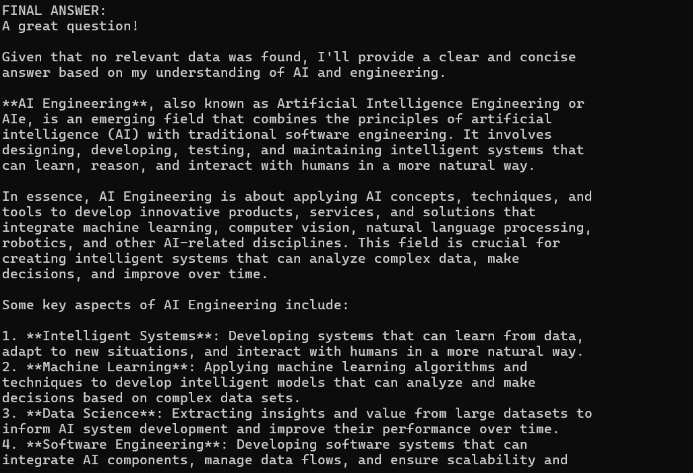
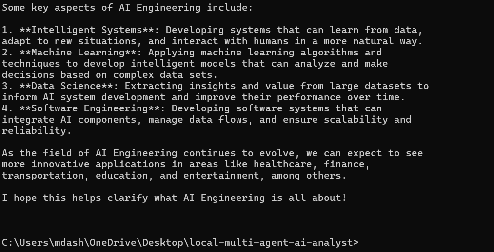
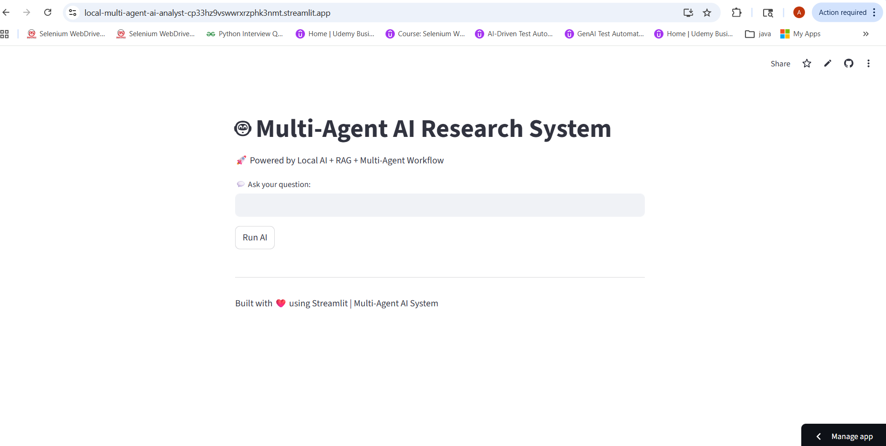
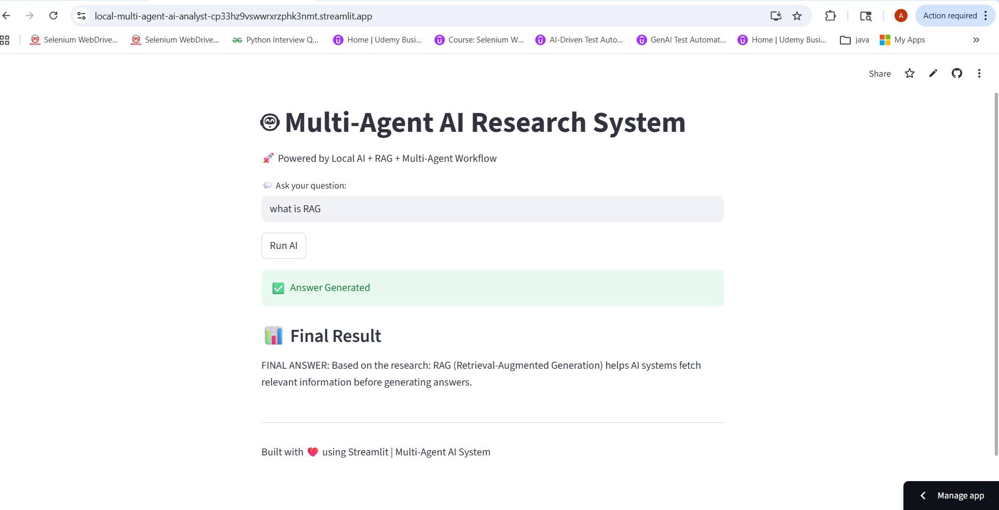

# 🤖 Local Multi-Agent AI System (No API)

This project is a fully local AI system that uses multiple agents to perform research, reasoning, and decision-making using RAG (Retrieval-Augmented Generation).

## 🔗 Live Demo
🚀 [Open AI App](https://local-multi-agent-ai-analyst-cp33hz9vswwrxrzphk3nmt.streamlit.app/)

## 🚀 Features
- Multi-agent architecture (Research, Reasoning, Decision)
- FAISS-based semantic search
- Local LLM using Ollama (LLaMA 3)
- Streamlit UI
- No API key required

## 🧠 Tech Stack
- Python
- LangChain / LangGraph (extendable)
- FAISS
- Sentence Transformers
- Streamlit
- Ollama

## ▶️ Run Locally

```bash
pip install -r requirements.txt
streamlit run ui.py
``` 
## 📸 UI Screenshots






